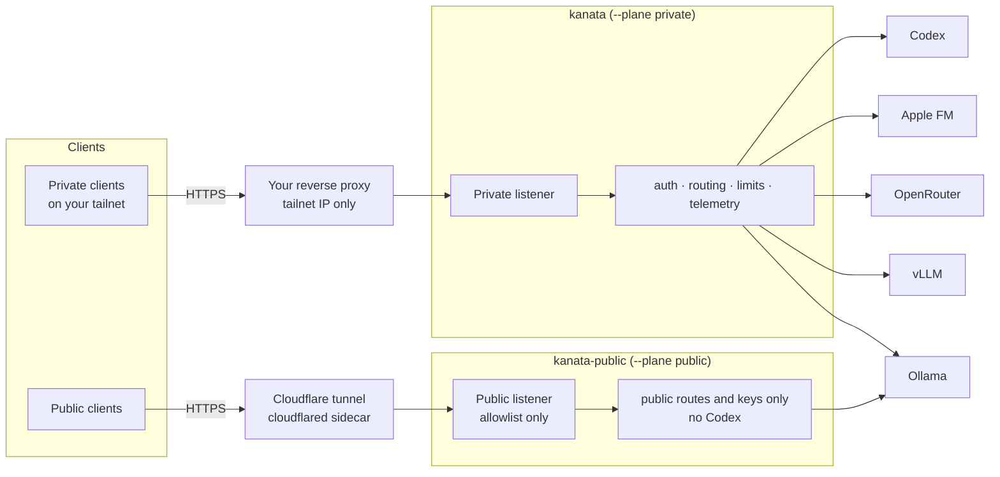

<div align="center">

# Kanata

**A lightweight Rust inference gateway: one OpenAI-compatible API in front of your local and remote models.**

*Built for homelabs. Designed as the model gateway for [kanade](https://github.com/hoshinoht/kanade-bot).*

[](CHANGELOG)
[](Cargo.toml)
[](LICENSE)
[](#api)

[Features](#features) · [Architecture](#architecture) · [Quick start](#quick-start) · [API](#api) · [Security](#security) · [Development](#development)

</div>

> **Kanata serves inference. Kanata does not perform inference.**
>
> Model execution, batching, tokenization, GPU scheduling and model loading belong to runtimes such as Ollama, vLLM and hosted providers. Kanata owns the application-facing boundary: keys, routing, validation, limits and a safe public edge.

> [!NOTE]
> **Beta (`1.0.0-beta.3`).** Kanata targets single-host personal deployments. Interfaces may still change before 1.0.

## At a glance

| | |
| --- | --- |
| **Endpoints** | `GET /v1/models` · `POST /v1/chat/completions` (JSON and SSE) · `POST /v1/audio/transcriptions` |
| **Backends** | Ollama · vLLM · OpenRouter · Apple Foundation Models (macOS 27+) · Codex (ChatGPT sign-in, experimental) |
| **Auth** | Static `kanata_sk_…` bearer keys with exact per-model scopes, stored as SHA-256 digests |
| **Listeners** | Private (behind your tailnet proxy) · optional public (Cloudflare tunnel) · loopback admin |
| **Deploy** | Distroless, non-root, read-only container; Compose profiles publish **no** host ports |

## Features

### 🧭 Routing
- **Exact routing:** each `(model alias, operation)` maps to one adapter and upstream model, with no wildcards, fallbacks or silent rewrites.
- **Multi-modal aliases:** one alias can serve several operations, e.g. chat and transcription.
- **Scoped listing:** `/v1/models` lists only what the caller's key may use, and each entry includes a `kanata` capability object.

### 🔌 Adapters

| Adapter | What it serves |
| --- | --- |
| **Ollama** | Chat, tools, structured output, sampling and reasoning controls |
| **vLLM** | Text chat, inline-audio chat, native ASR, and transcription through audio chat |
| **OpenRouter** | Chat with sampling, structured output and reasoning |
| **Apple Foundation Models** | Apple's on-device model through macOS 27's `fm serve`: chat, streaming, JSON-schema output and sampling. 8,192-token context, no tools. Expect loose formatting; guardrail refusals return `finish_reason: "content_filter"` |
| **Codex** ⚠️ *experimental* | ChatGPT-subscription models via device-code sign-in (private listener only), with effort aliases like `gpt-6-sol:high`. Uses an unofficial private backend that may change or break without notice |

### 🎛️ Typed generation options
- **Supported fields:** `response_format` (JSON object / JSON schema), `temperature`, `top_p`, `seed`, `max_tokens` / `max_completion_tokens` and `reasoning_effort`.
- **Bounds:** each field is validated and size-limited.
- **Capability-gated:** if a route can't honour an option, the request gets **400 naming the parameter** instead of a silent drop.
- **Tools pass through:** tool declarations, calls and results are forwarded. Kanata never executes tools.

### 🔐 Keys and exposure
- **`kanata key new`:** issues keys. The server stores only their digests.
- **Owner key:** only one key may be the owner. Any key may be given Codex scopes, but Codex is never served publicly, and with the public profile the public container never loads the owner key or any key with Codex scopes, so use a separate key for public routes.
- **Public listener:** its allowlist is empty by default. Missing or invalid keys get 403 on **every** path, and it never serves Codex.

### 📈 Operations
- **Admission and limits:** bounded admission, request bodies and uploads, and phased timeouts.
- **Lifecycle:** cancellation on client disconnect and graceful drain.
- **Logs:** one access line per request (key id, model, status, timing), and upstream-failure diagnostics that never include keys, prompts or bodies.
- **Metrics:** Prometheus-style `/metrics` with per-key and per-model counters.

## Architecture



Both listeners sit on internal Docker networks; the container publishes no host ports. See [the contract notes](docs/architecture/kanata-mvp.md) for core types and boundaries.

## Quick start

**Requirements:** Docker with Compose v2, plus any reverse proxy that can join a Docker network (e.g. Caddy) for the private route.

```sh
# 1. Build
scripts/kanata.sh build

# 2. Configure (config/config.toml is git-ignored)
cp config/container.example.toml config/config.toml   # edit tailnet address, adapters, routes
cp .env.example .env                                   # file paths + Compose file list only

# 3. Create the owner key (key stays on the host, digest goes into the config), then start
mkdir -p ~/.config/kanata && chmod 700 ~/.config/kanata
scripts/kanata.sh owner-key rotate --no-restart
scripts/kanata.sh up
scripts/kanata.sh logs
```

**Next steps:**

| Step | Guide |
| --- | --- |
| Put your reverse proxy on `kanata_private_ingress` → `172.30.0.2:8080` | [deploy/docker](deploy/docker/README.md) |
| Expose chosen models publicly through a Cloudflare tunnel | [deploy/cloudflared](deploy/cloudflared/README.md) |
| Sign in to Codex | `scripts/kanata.sh codex login` |
| Issue a key for someone else | `scripts/kanata.sh key new alice ~/.config/kanata/keys/alice.key --chat <alias>` |
| Rotate the owner key | `scripts/kanata.sh owner-key rotate` |
| Everything else (`status`, `restart`, `check`, `down`, …) | `scripts/kanata.sh help` |
| Config fields and templates | [config/README.md](config/README.md) |

## API

Kanata works with the official OpenAI SDKs and any client that lets you set a base URL:

```sh
curl https://kanata.example.com/v1/chat/completions \
  -H "Authorization: Bearer $KANATA_API_KEY" \
  -H "Content-Type: application/json" \
  -d '{"model":"qwen3-0.6b","messages":[{"role":"user","content":"Say hello"}]}'
```

`/v1/models` tells clients what each alias supports:

```json
{
  "id": "gpt-6-luna:low",
  "object": "model",
  "owned_by": "kanata",
  "kanata": {
    "operations": ["chat"],
    "structured_output": false,
    "sampling_controls": false,
    "reasoning_control": true,
    "reasoning_efforts": ["low", "medium", "high"],
    "function_tools": true,
    "streaming": true,
    "input_audio": false,
    "trust_zone": "external",
    "context_tokens": null
  }
}
```

`context_tokens` is the route's declared context window, or `null` for the provider's full window (cloud models). For local Ollama models, see [context length](config/README.md#concepts).

Share [the API quickstart](docs/guides/public-api-quickstart.md) with people you give keys to.

## Security

> [!IMPORTANT]
> Keys are bearer credentials: whoever holds one gets its scopes. Only one key may be `owner = true`. Any key may hold Codex scopes on the private listener; treat such keys like the owner key.

> [!WARNING]
> **Separate processes, shared host.** With the public profile, the public listener runs in its own `kanata-public` container (`kanata serve --plane public`) that loads only public routes, their adapters and public keys: no Codex adapter, credentials or volume. It still shares the host, the Docker daemon and backends such as Ollama, and Docker bridges alone don't isolate containers from each other. Running both listeners in one process (`--plane all`, the default outside Compose) puts the Codex credentials in the public process again.

> [!CAUTION]
> **Codex** uses ChatGPT's private backend with *your* sign-in; it may change without notice. OpenAI's [Terms of Use](https://openai.com/policies/terms-of-use/) forbid sharing account access, so never expose Codex to other people.

- **Host isolation:** Docker bridges alone don't isolate containers from each other or from the host, so use a host firewall.
- **Cloudflare Access** on the public route is optional defence in depth, never a replacement for keys.
- **Suspected compromise:** run `scripts/kanata.sh owner-key rotate`. It rotates the owner key immediately and prints what else to rotate: other keys, the Codex sign-in, the tunnel token, and proxy DNS tokens.

## Development

Requires Rust **1.98+**.

```sh
cargo fmt --all -- --check
cargo clippy --all-targets --all-features -- -D warnings
cargo test --all-targets
cargo run -q -- check --config config/container.example.toml
```

<details>
<summary>Repository layout</summary>

| Path | Contents |
| --- | --- |
| `src/api`, `src/server` | HTTP handlers, listeners, wire decoding |
| `src/core`, `src/routing`, `src/auth` | Provider-neutral contracts, route registry, key auth |
| `src/adapter/*` | Ollama (also Apple FM), vLLM, OpenRouter, Codex, shared transport |
| `src/telemetry` | Access logs, diagnostics, metrics |
| `config/` | Templates (your `config.toml` is git-ignored) |
| `compose.kanata*.yml`, `Dockerfile` | Container and Compose profiles |
| `scripts/` | Codex login, client keys, owner-key rotation |
| `tests/` | Integration tests and sanitized fixtures (`tests/fixtures/config/example.toml` is a schema fixture; never serve it) |

</details>

## Non-goals

Kanata is not an inference engine, GPU scheduler, model manager, agent framework, tool executor, training platform, or LiteLLM clone. Dynamic plugin ABIs and a distributed control plane are out of scope.

## License

[GNU General Public License v3.0](LICENSE)
