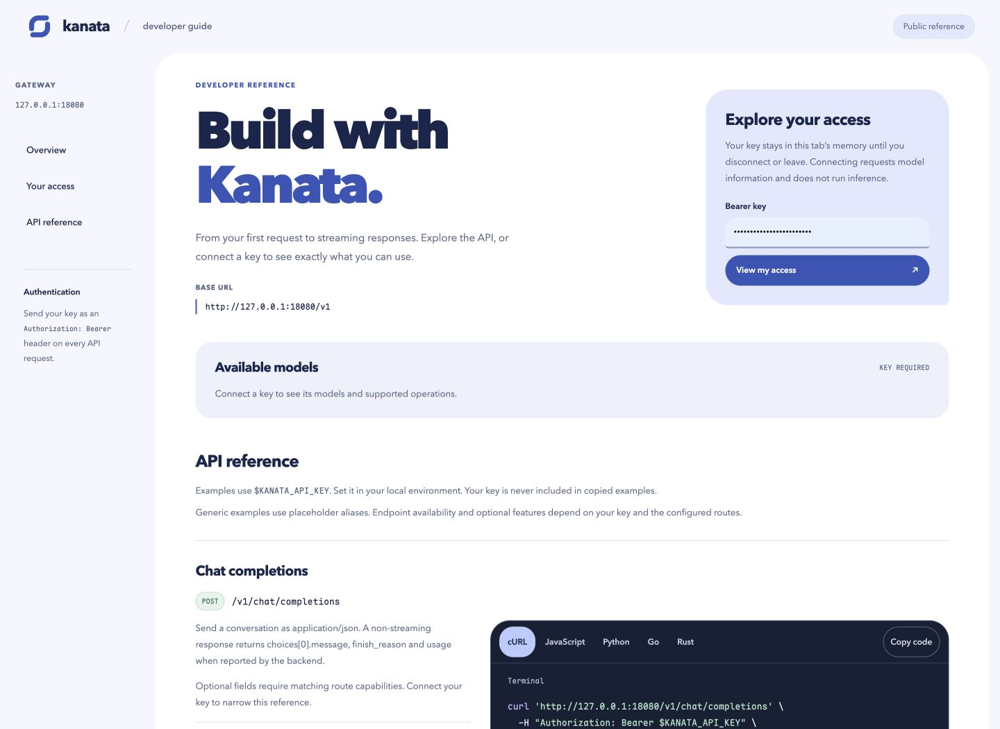
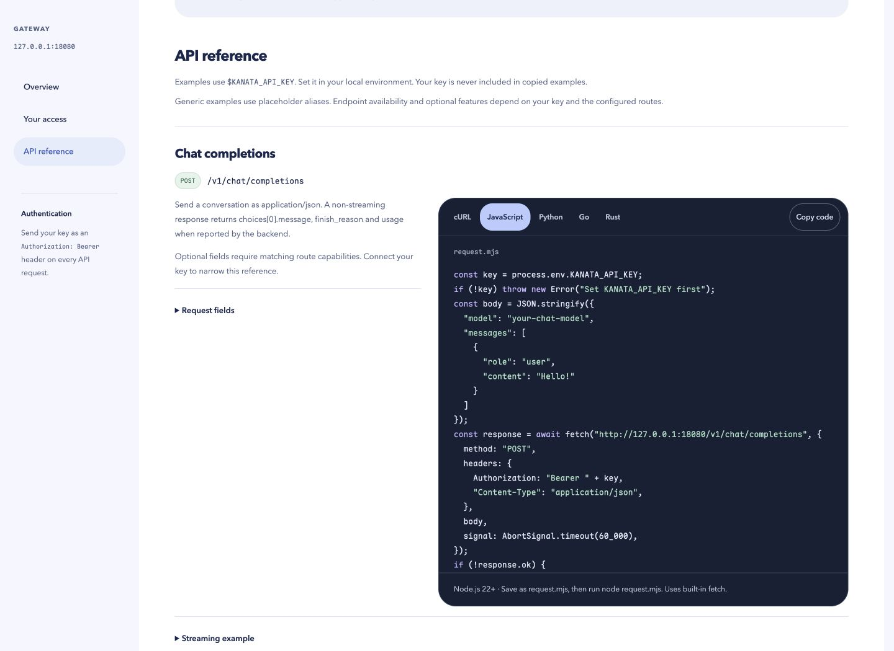
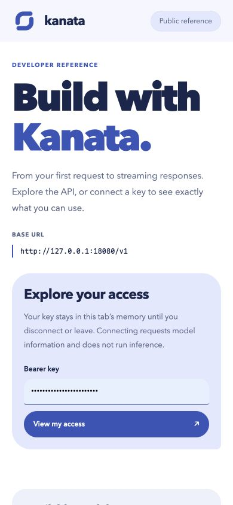
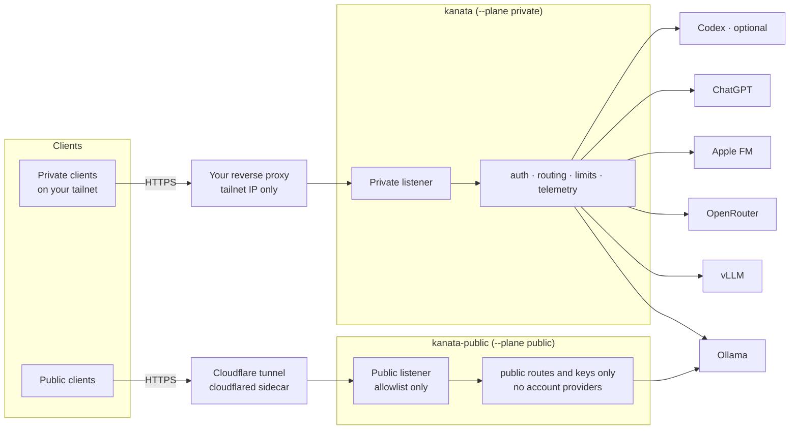

<div align="center">


# Kanata

**A lightweight Rust inference gateway: one OpenAI-compatible API in front of your local and remote models.**

*Built for homelabs. Designed as the model gateway for [kanade](https://github.com/hoshinoht/kanade-bot).*

[](CHANGELOG)
[](Cargo.toml)
[](LICENSE)
[](#api)

[Features](#features) · [Architecture](#architecture) · [Quick start](#quick-start) · [API](#api) · [Security](#security) · [Build from source](#build-from-source)

</div>

> **Kanata serves inference. Kanata does not perform inference.**
>
> Model execution, batching, tokenization, GPU scheduling and model loading belong to runtimes such as Ollama, vLLM and hosted providers. Kanata owns the application-facing boundary: keys, routing, validation, limits and a safe public edge.

> [!NOTE]
> **Beta (`1.0.0-beta.6`).** Kanata targets single-host personal deployments. Interfaces may still change before 1.0.

## At a glance

| | |
| --- | --- |
| **Endpoints** | `GET /v1/models` · `POST /v1/chat/completions` (JSON and SSE) · `POST /v1/responses` (stateless text/tools/SSE) · `POST /v1/audio/transcriptions` · `POST /v1/embeddings` · `POST /v1/audio/speech` |
| **Backends** | Ollama · vLLM · OpenRouter · Apple Foundation Models (macOS 27+) · Codex (experimental) · Sign in with ChatGPT · speech |
| **Auth** | Static `kanata_sk_…` bearer keys with exact per-model scopes, stored as SHA-256 digests |
| **Listeners** | Private (behind your tailnet proxy) · optional public (Cloudflare tunnel) · loopback admin |
| **Deploy** | Distroless, non-root, read-only container; Compose profiles publish **no** host ports |

## Browser guide

A Material 3 Expressive reference with the [Relay identity](docs/brand/README.md), Maple Mono code and highlighted examples in five languages. Open `/v1` to browse, then connect a key to see its permitted models and operations.



<details>
<summary>Code examples and mobile layout</summary>





</details>

*Model aliases in examples are placeholders. Use authenticated `/v1/models` for your permitted inventory.*

## Features

### 🧭 Routing

- **Responses:** a [stateless text and function-call subset](docs/guides/responses.md) shares existing chat routes, key scopes, limits and usage accounting.
- **Exact routing:** each `(model alias, operation)` maps to one adapter and upstream model, with no wildcards, fallbacks or silent rewrites.
- **Multi-modal aliases:** one alias can serve several operations, e.g. chat and transcription.
- **Speech output:** exact speech routes convert bounded text into MP3/WAV with an explicit voice allowlist. See [speech output](docs/guides/speech-output.md).
- **Image input:** declared chat routes accept bounded inline PNG/JPEG images with Ollama, vLLM or OpenRouter. See [image input](docs/guides/image-input.md) and the [vision template](config/vision.example.toml).
- **Embeddings:** text or batches of up to 128 strings through Ollama, with float or base64 results. Embedding access has its own exact key scope. See the [embedding template](config/embeddings.example.toml).
- **Browser guide:** open `/v1` for public API documentation. Connect a key to see its permitted models, capabilities and examples on that listener. The page keeps the key only in memory; disconnect or navigate away to clear it. Examples include highlighted cURL, JavaScript, Python, Go and Rust, rendered in bundled Maple Mono. Use HTTPS outside localhost.
- **Scoped listing:** `/v1/models` lists only what the caller's key may use, and each entry includes a `kanata` capability object.

### 🔌 Adapters

| Adapter | What it serves |
| --- | --- |
| **Ollama** | Chat with inline images, tools, structured output, sampling, reasoning controls and text embeddings |
| **vLLM** | Text, inline-image and inline-audio chat with streaming and tools, native ASR, and transcription through audio chat; local, private or remote over HTTPS with an API key |
| **OpenRouter** | Chat with inline images, sampling, structured output, reasoning and tools; inline-audio chat (also with tools) and speech-to-text |
| **Apple Foundation Models** | Apple's on-device model through macOS 27's `fm serve`: chat, streaming, JSON-schema output and sampling. 8,192-token context, no tools. Expect loose formatting; guardrail refusals return `finish_reason: "content_filter"` |
| **ChatGPT** | Documented plan usage preview with browser sign-in; private text and function chat, complete or streaming |
| **Speech** | Bounded MP3/WAV output through a Kokoro-FastAPI compatible backend with voice and format allowlists |
| **Codex** ⚠️ *experimental* | ChatGPT-subscription models via device-code sign-in (private listener only), with effort aliases like `gpt-6-sol:high`. Uses an unofficial private backend that may change or break without notice |

### Sign in with ChatGPT

A separate private `chatgpt` provider supports host browser sign-in, protected account profiles, model discovery, and text/function chat through the documented plan usage preview. Start with [the setup and trial guide](docs/guides/sign-in-with-chatgpt.md) and [`config/chatgpt.example.toml`](config/chatgpt.example.toml). Compose deployments can use the [ChatGPT overlay and host sign-in helper](deploy/docker/README.md#sign-in-with-chatgpt). Verify model access with your own account after sign-in. The [Codex retirement overlay](deploy/docker/README.md#retire-the-experimental-codex-provider) preserves the experimental implementation while detaching its credentials; see the [client migration guide](docs/guides/service-handoff.md#move-existing-codex-routes-to-chatgpt) for preserving service aliases.

### 🎛️ Typed generation options
- **Supported fields:** `response_format` (JSON object / JSON schema), `temperature`, `top_p`, `seed`, `max_tokens` / `max_completion_tokens` and `reasoning_effort`.
- **Bounds:** each field is validated and size-limited.
- **Capability-gated:** if a route can't honour an option, the request gets **400 naming the parameter** instead of a silent drop.
- **Tools pass through:** tool declarations, calls and results are forwarded. Kanata never executes tools.
- **Reasoning (private listener only):** backend reasoning text is returned as `reasoning_content` (Codex gives a summary), with `completion_tokens_details.reasoning_tokens` when reported.

### 🔐 Keys and exposure
- **Host key CLI:** `kanata key new|list|show|edit|rm|rotate|migrate` manages keys in `keys.toml` on the host (no network or admin endpoint). Keys are shown once and stored only as SHA-256 digests; every key has an expiry (1–60 days or `unlimited`). Changes apply within about 2 s, without a restart.
- **Route reload:** send SIGHUP to adopt validated route, adapter and publication changes without interrupting active streams. Shared admission and usage state survive reload; incompatible settings require a restart. See [configuration reload](docs/guides/config-reload.md).
- **Private key portal:** `kanata portal --config <path>` opens a host-only dashboard on `127.0.0.1:9091` for creating, inspecting, editing, rotating and revoking keys. A one-use login code unlocks a one-hour browser session. Press Enter in the portal terminal or choose **New login code** while unlocked to renew it without restarting; see [private portal](docs/guides/private-portal.md).
- **Selectable reasoning levels:** pinned effort families advertise one model ID and key-accessible `kanata.reasoning_efforts`. Send the base ID with Chat `reasoning_effort` or Responses `reasoning.effort`; legacy suffixed requests remain accepted. See [client integration and migration](docs/guides/service-handoff.md).
- **Daily allowances:** optional per-key request limits and token reservations survive restarts. `kanata key usage` reports model and UTC-day usage with explicit missing reports and optional cost estimates; see [usage and quotas](docs/guides/usage-quotas.md). Each process plane has a separate allowance.
- **Usage and audit:** the server records per-key request counts, last use and reported token totals; the CLI appends every change to `keys/audit.jsonl` (never secrets).
- **Owner key:** only one key may be the owner. Any key may be given private provider scopes. Codex and ChatGPT sign-in routes are never served publicly, and the public container never loads the owner key or keys with either provider’s scopes, so use a separate key for public routes.
- **Public listener:** its allowlist is empty by default. Missing or invalid keys get 403 except on the exact public guide paths (`GET`/`HEAD /v1` and `/v1/`); it never serves Codex or the Sign in with ChatGPT provider.

### 📈 Operations
- **Admission and limits:** bounded admission, shared request-buffer reservations, upload concurrency limits and a dedicated upload deadline.
- **Lifecycle:** cancellation on client disconnect and graceful drain.
- **Logs:** one access line per request (key id, model, status, timing, reasoning effort, and on the private listener the caller's `x-request-id` when sent), and upstream-failure diagnostics that never include keys, prompts or bodies.
- **Metrics:** Prometheus-style `/metrics` with per-key/model counters, queue and upstream timing, first-content latency, buffer occupancy and key-reload health. See [operations](docs/guides/operations.md).

## Architecture


```mermaid
flowchart LR
  subgraph Clients
    P[Private clients<br/>on your tailnet]
    X[Public clients]
  end
  P -->|HTTPS| RP[Your reverse proxy<br/>tailnet IP only]
  X -->|HTTPS| CF[Cloudflare tunnel<br/>cloudflared sidecar]
  RP --> KP
  CF --> KU
  subgraph Private["kanata (--plane private)"]
    KP[Private listener]
    CORE[auth · routing · limits · telemetry]
    KP --> CORE
  end
  subgraph Public["kanata-public (--plane public)"]
    KU[Public listener<br/>allowlist only]
    PCORE[public routes and keys only<br/>no account providers]
    KU --> PCORE
  end
  CORE --> O[Ollama]
  CORE --> V[vLLM]
  CORE --> R[OpenRouter]
  CORE --> A[Apple FM]
  CORE --> G[ChatGPT]
  CORE --> C[Codex · optional]
  PCORE --> O
```

Both listeners sit on internal Docker networks; the container publishes no host ports. See [operations](docs/guides/operations.md) and [security boundaries](SECURITY.md) for listener configuration and isolation.

## Quick start

**Requirements:** Docker with Compose v2, plus any reverse proxy that can join a Docker network (e.g. Caddy) for the private route.

```sh
# 1. Build
scripts/kanata.sh build

# 2. Configure (config/config.toml is git-ignored)
cp config/container.example.toml config/config.toml   # edit tailnet address, adapters, routes
cp .env.example .env                                   # file paths + Compose file list only

# 3. Install the host CLI, create the owner key (key stays on the host, digest goes into config/keys/keys.toml), then start
cargo install --locked --path .
mkdir -p ~/.config/kanata && chmod 700 ~/.config/kanata
kanata key new --config config/config.toml --id owner --owner --chat <alias> --expires 30 \
  --key-out ~/.config/kanata/owner-client-key
scripts/kanata.sh up
scripts/kanata.sh logs
```

**Next steps:**

| Step | Guide |
| --- | --- |
| Put your reverse proxy on `kanata_private_ingress` → `172.30.0.2:8080` | [deploy/docker](deploy/docker/README.md) |
| Expose chosen models publicly through a Cloudflare tunnel | [deploy/cloudflared](deploy/cloudflared/README.md) |
| Sign in to Codex | `scripts/kanata.sh codex login` |
| Issue a key for someone else | `kanata key new --config config/config.toml --id alice --chat <alias> --expires 30` |
| List, inspect, change or revoke keys | `kanata key list`, `key show`, `key edit`, `key rm` (each with `--config`); see `kanata key` |
| Manage deployed keys in your browser | `scripts/kanata.sh portal`; see [private portal](docs/guides/private-portal.md) |
| Sign in with ChatGPT for the private container | `scripts/kanata.sh chatgpt login`; see [Docker setup](deploy/docker/README.md#sign-in-with-chatgpt) |
| Which routes are public | `kanata routes --config config/config.toml` |
| Rotate the owner key | `kanata key rotate --owner --config config/config.toml --expires 30 --key-out ~/.config/kanata/owner-client-key` |
| Everything else (`status`, `restart`, `check`, `down`, …) | `scripts/kanata.sh help` |
| Config fields and templates | [config/README.md](config/README.md) |

## API

Kanata works with the official OpenAI SDKs and any client that lets you set a base URL:

```sh
curl https://kanata.example.com/v1/chat/completions \
  -H "Authorization: Bearer $KANATA_API_KEY" \
  -H "Content-Type: application/json" \
  -d '{"model":"qwen3-0.6b","messages":[{"role":"user","content":"Say hello"}]}'
```

`/v1/models` tells clients what each alias supports:

```json
{
  "id": "gpt-6-luna:low",
  "object": "model",
  "owned_by": "kanata",
  "kanata": {
    "operations": ["chat"],
    "structured_output": false,
    "sampling_controls": false,
    "reasoning_control": true,
    "reasoning_efforts": ["low", "medium", "high"],
    "function_tools": true,
    "streaming": true,
    "input_audio": false,
    "trust_zone": "external",
    "context_tokens": null,
    "max_output_tokens": null,
    "admission": { "max_in_flight": 8, "max_queue": 32, "queue_ms": 1000, "adapter_max_in_flight": null }
  }
}
```

`context_tokens` is the route's declared context window, or `null` for the provider's full window (cloud models). For local Ollama models, see [context length](config/README.md#concepts). `max_output_tokens` is the route's declared output cap (`null` if none); a larger `max_tokens` is rejected, and omitted limits inherit the cap. `admission` shows the per-route limits from `[limits]` and `[timeouts]`, plus the backend's shared cap (`null` if uncapped), and appears only on the private listener. When a route or backend is full, Kanata answers `429 gateway_queue_full`, or `503 gateway_busy` if no slot frees up within `queue_ms`. Per-key limits answer `429 gateway_key_busy` or `429 gateway_key_rate_limited`, and a backend whose circuit breaker is open answers `503 upstream_unavailable` straight away. All of these carry `Retry-After` and are separate from an upstream `429 rate_limit_exceeded` or `504 upstream_timeout`. See [capacity](config/README.md#concepts).

Share [the API quickstart](docs/guides/public-api-quickstart.md) with people you give keys to.

## Security

> [!IMPORTANT]
> Keys are bearer credentials: whoever holds one gets its scopes. Only one key may be `owner = true`. Any key may hold Codex scopes on the private listener; treat such keys like the owner key.

> [!WARNING]
> **Separate processes, shared host.** With the public profile, the public listener runs in its own `kanata-public` container (`kanata serve --plane public`) that loads only public routes, their adapters and public keys: no Codex adapter, credentials or volume. It still shares the host, the Docker daemon and backends such as Ollama, and Docker bridges alone don't isolate containers from each other. Running both listeners in one process (`--plane all`, the default outside Compose) puts the Codex credentials in the public process again.

> [!CAUTION]
> **Codex** uses ChatGPT's private backend with *your* sign-in; it may change without notice. OpenAI's [Terms of Use](https://openai.com/policies/terms-of-use/) forbid sharing account access, so never expose Codex to other people.

- **Public documentation:** only `GET`/`HEAD /v1` and `/v1/` serve a generic page without authentication. `/v1/models` and inference endpoints still require a key. No configured models, backend addresses or credentials are embedded in the public page. Scripts and styles are embedded with a restrictive Content Security Policy; personalized discovery responses are not cached.
- **Host isolation:** Docker bridges alone don't isolate containers from each other or from the host, so use a host firewall.
- **Cloudflare Access** on the public route is optional defence in depth, never a replacement for keys.
- **Key management is host-only:** `kanata key` edits `keys.toml` directly (0600, one writer at a time) and has no network path. The optional `kanata portal` is a separate host command restricted to IPv4 loopback, with a one-use terminal login code and exact browser-origin checks. The gateway listeners have no key-management endpoint. The server rejects a group- or world-writable keys file and keeps the previous keys when a reload fails. Expired keys get `401 key_expired`; revoked keys are treated exactly like unknown keys.
- **Suspected compromise:** run `kanata key rotate --owner --config <config> --expires <days> --key-out <file>` (takes effect within about 2 s), revoke other keys with `kanata key rm`, then rotate the Codex sign-in, the tunnel token, and proxy DNS tokens.

## Build from source

Requires Rust **1.98+**:

```sh
cargo install --locked --path .
kanata check --config /path/to/config.toml
kanata serve --config /path/to/config.toml --plane private
```

Use the host binary for key management, the [private portal](docs/guides/private-portal.md) and ChatGPT sign-in, including when inference runs in Docker.

## Non-goals

Kanata is not an inference engine, GPU scheduler, model manager, agent framework, tool executor, training platform, or LiteLLM clone. Dynamic plugin ABIs and a distributed control plane are out of scope.

## License

[GNU General Public License v3.0](LICENSE)
