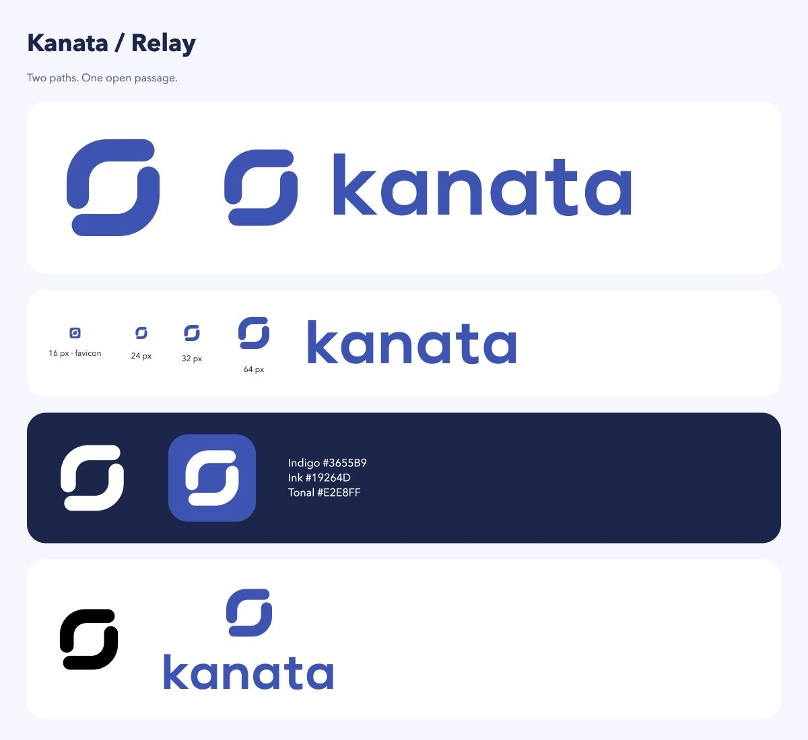

# Kanata Relay

Two opposing rounded paths form an open passage. The curves echo the guide’s Material 3 Expressive shapes.

## Files

- [Symbol master](../../src/server/guide/relay.svg): indigo, two filled paths on a 256-unit grid.
- [Black](relay-black.svg) and [white](relay-white.svg): one-colour versions.
- [Horizontal](horizontal.svg), [stacked](stacked.svg) and [wordmark](wordmark.svg): original geometric letterforms, stored as outlines. No font dependency.
- [PNG icons](icons/) at 16, 32, 48, 180, 192 and 512 px, plus [favicon.ico](icons/favicon.ico), exported with Quick Look and transparency recovery using Pillow. The guide embeds the SVG favicon; these downloads need no additional gateway routes.
- [App icon](app-icon.svg) and [embedded favicon](../../src/server/guide/favicon.svg): white mark on indigo for light and dark browser chrome.

## Usage

Indigo **#3655B9**, ink **#19264D**, tonal surface **#E2E8FF**, paper **#FFFFFF**. Use indigo or black on light backgrounds; white on ink or indigo. Preserve the open centre and original proportions. Avoid gradients, shadows, extra outlines and rotations.

Keep at least one stem width (44 units of the 256-unit symbol) clear around visible artwork. Minimum symbol size: 24 CSS px; the favicon tile is checked separately at 16 px. Keep horizontal lockups at least 160 px wide and standalone wordmarks at least 120 px wide. Use the symbol alone when space is tight.

The guide’s live wordmark remains accessible HTML text in its system sans-serif stack. Code uses the separately licensed [Maple Mono](../../src/server/guide/fonts/README.md).

## Verification

SVG source is audited with the logo-design skill’s `svg_audit.py`. Browser checks cover the mark at 16/24/32/64 px, one-colour and reversed versions, and the final desktop/mobile guide. README screenshots show local public reference content, with placeholder model aliases.
